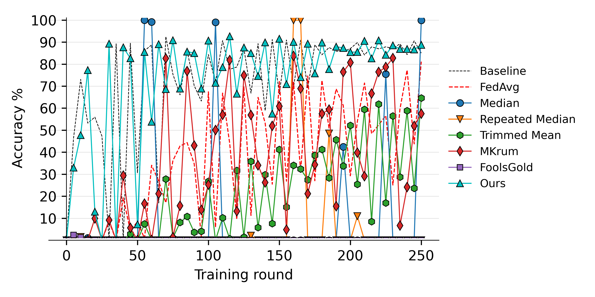
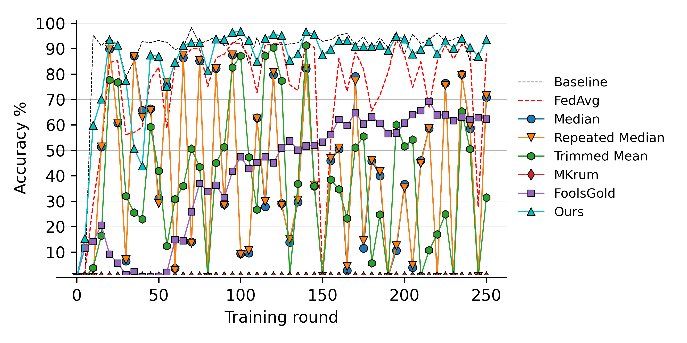
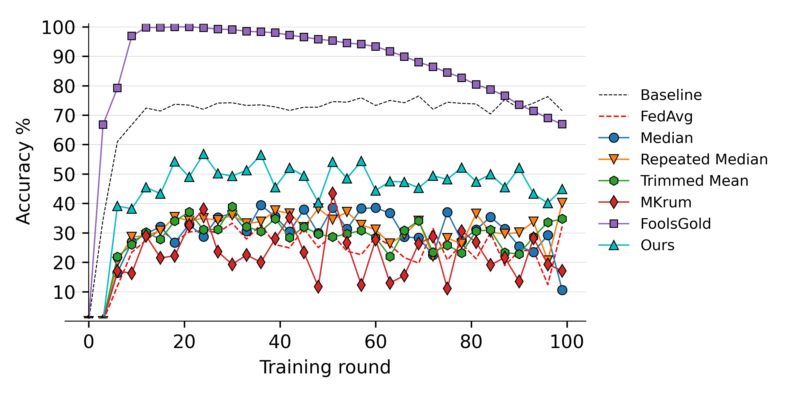
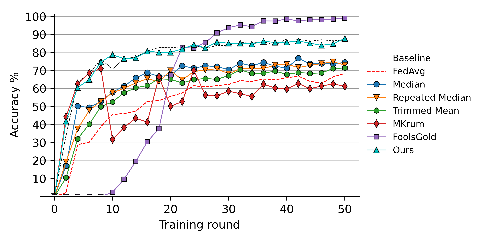

#Defending against Label-flipping Attacks in Federated Learning
This repository contains PyTorch implementation of the paper: Defending against Label-flipping Attacks in Federated Learning.

## Paper 

[Defending against Label-flipping Attacks in Federated Learning]

## Content
The repository contains one jupyter notebook: `Experiments.IPYNB` in each folder which can be used to re-produce the experiments reported in the paper. Each notebook contains clear instructions on how to run the experiments. 

## Data sets
[MNIST](http://yann.lecun.com/exdb/mnist/) and [CIFAR10](https://www.cs.toronto.edu/~kriz/cifar.html) will be automatically downloaded.
However, [IMDB](https://ai.stanford.edu/~amaas/data/sentiment/) requires a manual download using this [link](https://drive.google.com/file/d/1X86CyTJW77a1CCkAFPvN6pqceN63q2Tx/view?usp=sharing). 
After downloading [IMDB](https://ai.stanford.edu/~amaas/data/sentiment/), please save it as IMDB Dataset.csv in the data folder inside the folder IMDB.

## Dependencies

[Python 3.6](https://www.anaconda.com/download)

[PyTorch 1.6](https://pytorch.org/)

[TensorFlow 2](https://www.tensorflow.org/)

## Results

*Results of source class stability under the label-flipping attack on the MNIST-1 benchmark with 4 attackers (left), 5 attackers (right).*   

*Results of source class stability under the label-flipping attack with 6 attackers on the MNIST-2 benchmark (left), CIFAR10 benchmark (middle) and IMDB benchmark (right).*
  

## Citation 

## Funding
